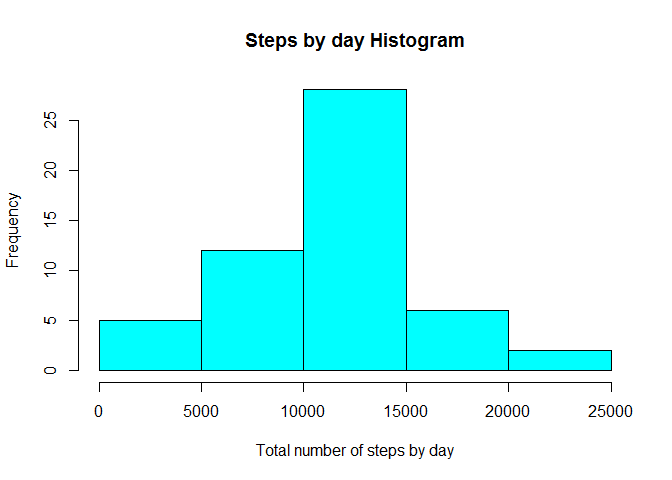
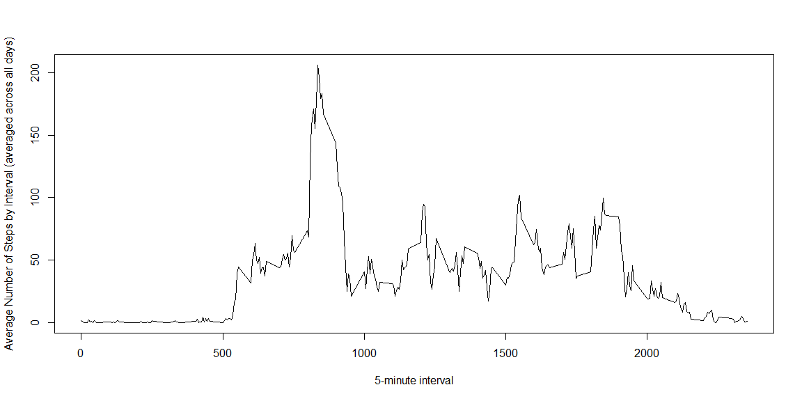
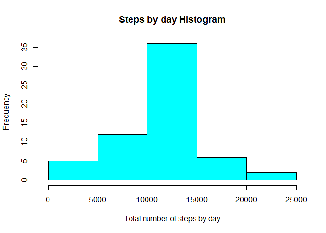
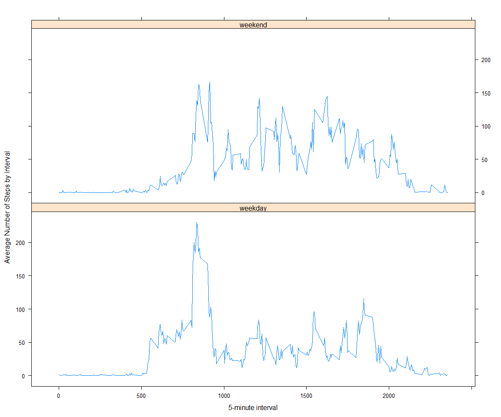

# Reproducible Research: Peer Assessment 1
By Paulo José Souza de Assunção (paulo.assuncao@gmail.com)  


<br/>

### Loading and preprocessing the data


```r
# Reading raw data from file
raw_data <- read.csv("./data/activity.csv", header = TRUE, sep = ",")
```

### What is mean total number of steps taken per day?


```r
data <- transform(raw_data, date = factor(date))

# Calculating the 'Total Number of Steps by day'
total_steps_by_day <- tapply(data$steps, data$date, sum)

# Plotting a histogram for 'Total Number of Steps by Day'
hist(total_steps_by_day, xlab = "Total number of steps by day", col = "cyan", main = "Steps by day Histogram")
```

 

```r
# Calculating Mean and Median to 'Total Number of Steps by Day'
mean_steps <- mean(total_steps_by_day, na.rm = "true")
median_steps <- median(total_steps_by_day, na.rm = "true")
```

Mean of steps of the total number of steps taken per day: **10766.19**

Median of steps of the total number of steps taken per day: **10765**

### What is the average daily activity pattern?


```r
library(stringr)

data <- raw_data[!is.na(raw_data$steps),]
data <- transform(data, interval = factor(interval))

# Calculate the average number of steps by interval across all days
mean_steps_by_interval <- tapply(data$steps, data$interval, mean)
mean_steps_by_interval <- data.frame(interval = str_pad(names(mean_steps_by_interval), 4, pad = "0"), 
                                     steps = unname(mean_steps_by_interval), stringsAsFactors = FALSE)

# Plotting Average Number of Steps by Interval  
plot(mean_steps_by_interval$steps ~ mean_steps_by_interval$interval, type = "l", 
     xlab = "5-minute interval", ylab = "Average Number of Steps by Interval (averaged across all days)")
```

 

```r
# Finding the interval where average number of steps reachs its maximum value
interval <- mean_steps_by_interval[mean_steps_by_interval$steps == max(mean_steps_by_interval$steps), ][1,1]
```

The interval where average number of steps reachs its maximum value is: **0835**

### Inputing missing values


```r
# Counting the number of missing values of original dataset
missing_values <- raw_data[is.na(raw_data$steps),]
total_missing_values <- nrow(missing_values)
```

The total number of missing values in the dataset is: **2304**

Fixing raw dataset using average number of steps by interval (averaged across all days)...  


```r
data <- raw_data[!is.na(raw_data$steps),]
data <- transform(data, interval = factor(interval))

# Calculating average number of steps by interval
mean_steps_by_interval <- tapply(data$steps, data$interval, mean)

# Converting in a data frame
mean_steps_by_interval <- data.frame(interval = names(mean_steps_by_interval), 
                                     steps = unname(mean_steps_by_interval))

# Merging missing values data frame with the data frame containing average number of steps by interval
fixed_raw_data <- merge(missing_values, mean_steps_by_interval, by.x = "interval", by.y = "interval")


# Making same adjustments... 
names(fixed_raw_data)[names(fixed_raw_data) == "steps.y"] <- "steps"
fixed_raw_data$steps.x <- NULL

# Fusioning fixed missing values data frame and not NA part of original data frame  
fixed_raw_data <- rbind(raw_data[!is.na(raw_data$steps),], fixed_raw_data) 
```

Plotting histogram and recalculating Mean and Median using fixed dataset...


```r
# Calculating the 'Total Number of Steps by days' (using 'fixed_raw_data' dataset)
data <- transform(fixed_raw_data, date = factor(date))
total_steps_by_day <- tapply(data$steps, data$date, sum)

# Plotting a histogram to 'Total Number of Steps by Day'
hist(total_steps_by_day, xlab = "Total number of steps by day", col = "cyan", main = "Steps by day Histogram")
```

 

```r
# Calculating Mean and Median to 'Total Number of Steps by Day'
mean_steps <- mean(total_steps_by_day, na.rm = "true")
median_steps <- median(total_steps_by_day, na.rm = "true")
```

Mean of steps of the total number of steps taken per day: **10766.19**

Median of steps of the total number of steps taken per day: **10766.19**

As we can see, mean value didn't change while median changed softly. 
Generally (as expected) the inputed values raised up total daily number of steps but didn't have a major effect over statistical behaviour. Without them we already had a good sample to extract desired information. 

### Are there differences in activity patterns between weekdays and weekends?


```r
library(lattice)

# Using function weekdays() to create a new field (day_of_week) 
fixed_raw_data$day_of_week <- weekdays(as.Date(fixed_raw_data$date))

# Setting Saturday and Sunday to 'weekend'. 
# Note: 'sábado' is 'Saturday' and 'domingo' is 'Sunday' in Portuguese.
fixed_raw_data$day_of_week[fixed_raw_data$day_of_week == "sábado" | 
                           fixed_raw_data$day_of_week == "domingo"] <- "weekend"
# Setting other days to 'weekday'
fixed_raw_data$day_of_week[fixed_raw_data$day_of_week != "weekend"] <- "weekday"

# Converting field 'day_of_week' in a factor variable
fixed_raw_data <- transform(fixed_raw_data, day_of_week = factor(day_of_week))

data <- fixed_raw_data
# Calculating average number of steps grouped by type of day of week and interval
mean_steps_by_int_dow <- tapply(data$steps, factor(paste(data$day_of_week, data$interval, sep = ":")), mean)

# Code below rebuilds the original data frame with a new column (steps) that
# storages the average number of steps grouped by type of day of week and interval
factor_list <- unlist(strsplit(names(mean_steps_by_int_dow), split = ":"))

dow <- character(length(factor_list)/2) 
itv <- integer(length(factor_list)/2)

index_dow <- 0;
index_itv <- 0;

for(i in 1:length(factor_list)) {
     if (i %% 2 == 0) {
        index_itv <- index_itv + 1
        itv[index_itv] <- as.integer(factor_list[i])
     } else {
        index_dow <- index_dow + 1
        dow[index_dow] <- factor_list[i]
     }
}

# Creating a data frame to plot
mean_steps_by_int_dow <- data.frame(day_of_week = dow, interval = itv, steps = unname(mean_steps_by_int_dow))
mean_steps_by_int_dow <- mean_steps_by_int_dow[order(mean_steps_by_int_dow$interval),]

# Plotting graphs in two panels (one by each type of day of week)
xyplot(mean_steps_by_int_dow$steps ~ mean_steps_by_int_dow$interval | mean_steps_by_int_dow$day_of_week, 
       type = 'l', layout = c(1, 2), xlab = "5-minute interval", ylab = "Average Number of Steps by Interval")
```

 
